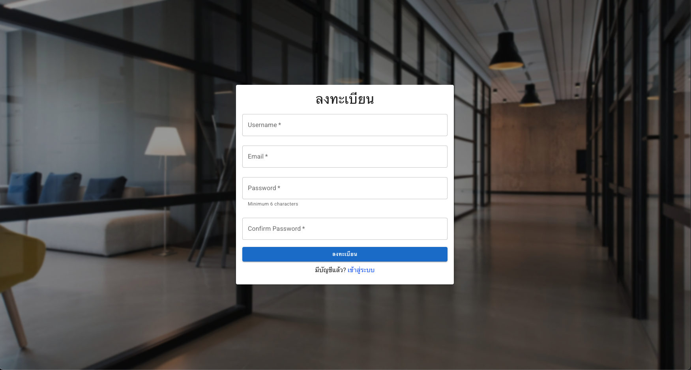
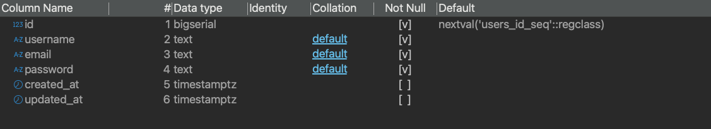

# tb-poc-login
### How to use project
1. Run `openssl rand -base64 64` to generate a secure `JWT_SECRET`.
2. Set up `.env` files for both the `api` and `ui` services, following the provided `.env.example` files.
3. Run `docker compose up --build -d` to start the application.

### Demo

### Database

